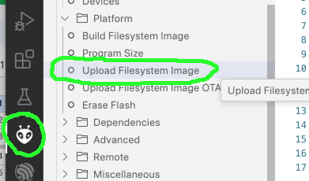
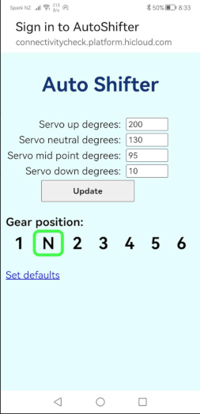
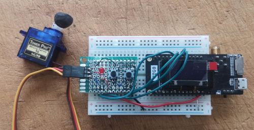

# ESP32 Streamliner shifter

ESP32StreamlinerShifter WiFi enabled gear shifter for streamliner motorcycle.
Written in Arduino C for the ESP32 embeded microcontroller.

The function of the gear shifter is to change through the gears on a landspeed streamliner motorcycle.
~1 second press on 'up' button to change up a gear, ~1 second press on 'down' button to change down a gear.

Long press on up when in 1st gear to 'half change' into neutral.
Gear box positons are; 1st | Neutral | 2nd | 3rd | 4th | 5th | 6th

The gearbox shifter is connected via a linkage to a servo motor.

Paramaters need to be adjusted for this process to work smoothly, most notably the servo positons required for a gear change.

These paramaters are set through the ESP32's WiFi interface. So the whole process can be done trackside.

Once paramaters are set they are maintained between reboots in the ESP32's NVS storage.

Author: Matt Way 2023 (https://github.com/matt-kiwi)
This project is done in the spirt of OpenSource and the memory of Burt Munro the orginal DIY streamliner.

Please see Landspeed New Zealand (https://www.landspeed.org.nz/)

**To Do List**<br>
* Add NVS version so NVS structure and firmware are in sync
* Add Defaults version number to alert of changes to sample_defaults, include instructions on how to do diff in VSCode
* Rename NVS routines to prefernces.
* Move Gear change code to a FreeRTOS thead
* Implement semaphores / mutex to stop multiple triggers on gear change
* Add servo settle time
 

**Reason for writing this code sample**<br/>
This code is meant to be a simple working example of using the following technologies.
* ESP32 as WiFi access point
* Captive portal / DNS
* ESP32 EasyAsync Web Server
* * Serving files from LittleFS file system
* * HTML Template processing
* * Processing HTML input forms
* * Async HTML5 Web Sockets
* Arduino JSON
* Storing paramaters in non volatile NVS flash
* Interrupt driven button debouncing
* Servo control
* Hardware watch dog timer

I hope this sample code can be used as a starting point for other WiFi controlled ESP32 projects.

## Requirements
* VSCode with PlatformIO extension. See the following on how to install VSCode/PlatformIO (https://platformio.org/platformio-ide)
* Suitable USB cable
* Two push button switches
* Servo motor note: adjust timing for servo motor see datasheet
* Optional neutral LED
* ESP32 Dev board (https://docs.platformio.org/en/latest/boards/espressif32/esp32dev.html)

## Building
After installing VSCode / PlatformIO IDE / Git
Clone the repository
```BASH
git clone https://github.com/econode/ESP32_Steamliner_shifter.git
```

Open the newly created project in PlatformIO IDE.

**Edit defaults.h**

Copy the src/sample_defaults.h file to src/defaults.h
The compiler will read sample_defaults.h if defaults.h is missing, defaults.h is ignored by GIT so any cahnges to defaults.h remain local / private.
defaults.h contains pin mappings, WiFi settings, and general default values.


**Upload file system**

*Note each time you alter any web related files in the /data folder you need to upload again.

The project uses the LittleFS (https://randomnerdtutorials.com/esp32-write-data-littlefs-arduino/).
You will need to format the ESP32's flash partition system and upload the littleFS file system image. The image is created from the files in the project/data directory.

Select PlatformIO icon in the left pain then click Project Tasks / Platform / Upload Filesystem Image.




**Compile and upload the firmware to the ESP32.**

Note: Most ESP32 development boards include a reset circuit, some boards you will need to manually.

Click on the compile & upload icon on the bottom of the IDE screen.


## To use
Connect to ESP32 WiFi access point, default name "AutoShifter".
Captive portal should redirect to 192.168.4.1 ,if not manually enter http://192.168.4.1 into your browser.

The gear "up" / "down" buttons simulate the hardware buttons on the ESP32 including timing, IE the period of time the button is held. 

Note: debug messages are outputed to the USB/Serial port @ 115,200 baud.

**Screenshot from SmartPhone**



**Bread board prototype used for testing**



**Servo datasheets**<br/>
SG90 1.8KG @ 5 volts [SG90 Servo datasheet](docs/SG90_servo_datasheet.pdf)<br/>
DS5160 65KG @ 7.4 volts [DS5160 Servo datasheet](docs/DS5160_servo_datasheet.pdf)<br/>


## License

**MIT License**
 [MIT](https://choosealicense.com/licenses/mit/)

Copyright (c) 2023 Econode NZ Ltd

Permission is hereby granted, free of charge, to any person obtaining a copy
of this software and associated documentation files (the "Software"), to deal
in the Software without restriction, including without limitation the rights
to use, copy, modify, merge, publish, distribute, sublicense, and/or sell
copies of the Software, and to permit persons to whom the Software is
furnished to do so, subject to the following conditions:

The above copyright notice and this permission notice shall be included in all
copies or substantial portions of the Software.

THE SOFTWARE IS PROVIDED "AS IS", WITHOUT WARRANTY OF ANY KIND, EXPRESS OR
IMPLIED, INCLUDING BUT NOT LIMITED TO THE WARRANTIES OF MERCHANTABILITY,
FITNESS FOR A PARTICULAR PURPOSE AND NONINFRINGEMENT. IN NO EVENT SHALL THE
AUTHORS OR COPYRIGHT HOLDERS BE LIABLE FOR ANY CLAIM, DAMAGES OR OTHER
LIABILITY, WHETHER IN AN ACTION OF CONTRACT, TORT OR OTHERWISE, ARISING FROM,
OUT OF OR IN CONNECTION WITH THE SOFTWARE OR THE USE OR OTHER DEALINGS IN THE
SOFTWARE.
