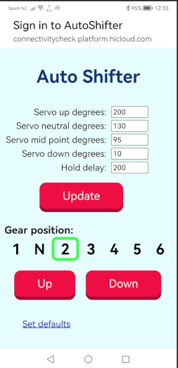

# ESP32 Streamliner shifter

ESP32StreamlinerShifter WiFi enabled gear shifter for stream liner motorcycle.

## Requirements
VSCode with PlatformIO extension

## To use
Connect to ESP32 WiFi access point.
Captive portal should redirect to 192.168.4.1 ,if not manually enter http://192.168.4.1 into your browser.

**Screenshot from SmartPhone##


## Change internal web server SSID / Password 
```C
#define WIFI_SSID "AutoShifter"
#define WIFI_PASSWORD "123456789"
```

## License

[MIT](https://choosealicense.com/licenses/mit/)
